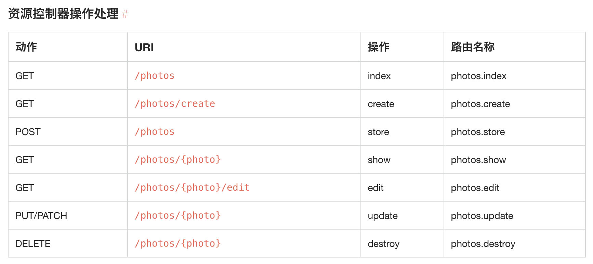

# 章节说明
> 本章节先从 `Laravel` 搭建静态页面开始，本教程静态页面模板来自 [Fly社区模板](https://github.com/layui/fly) , 感谢闲心大神的开源的模板

**本章节知识点**
* Artisan 命令使用
* [Laravel HTTP 路由功能](https://laravel.com/docs/5.4/routing)
* Laravel 视图功能
* 引入资源文件
* Blade 模板引擎

## 2.1 - 视图构建
**创建首页控制器**

```php
php artisan make:controller Front/IndexController --resource
```

> --resource 参数会在控制器中添加 `resource` 路由所需要的方法，不用手动创建

```php
<?php

namespace App\Http\Controllers\Front;

use Illuminate\Http\Request;
use App\Http\Controllers\Controller;

class IndexController extends Controller
{
    /**
     * Display a listing of the resource.
     *
     * @return \Illuminate\Http\Response
     */
    public function index()
    {
        echo __METHOD__;
    }

    ...
}
```

**为控制器添加 `resource` 路由**

所有的 `Laravel` 路由都在 `routes` 目录中的路由文件中定义，这些文件都由框架自动加载。在 `routes/web.php` 文件中定义你的 `web` 页面路由。这些路由都会应用 web 中间件组，其提供了诸如 `Session` 和 `CSRF` 保护等特性。定义在 `routes/api.php` 中的路由都是无状态的，并且会应用 `api` 中间件组，一般用户 `Api` 接口。

```php
Route::group(['namespace' => 'Front'], function ($router)
{
	$router->resource('index', 'IndexController');
});
```

**视图文件创建**

在 `resource/views` 目录下创建 `front` 目录，然后在 `front` 目录下创建 `index` 目录。 `index` 目录下创建首页视图文件 `index.blade.php`。
> 为了更好区分视图文件，我们创建对应的控制器文件夹进行存放视图

创建文件结构如下：


我们讲模板文件 `index.html` 代码复制到 `index.blade.php` 中：

```html
<!DOCTYPE html>
<html>
<head>
  <meta charset="utf-8">
  <title>基于 layui 的极简社区页面模版</title>
  <meta name="viewport" content="width=device-width, initial-scale=1, maximum-scale=1">
  <meta name="keywords" content="fly,layui,前端社区">
  <meta name="description" content="Fly社区是模块化前端UI框架Layui的官网社区，致力于为web开发提供强劲动力">
  <link rel="stylesheet" href="../res/layui/css/layui.css">
  <link rel="stylesheet" href="../res/css/global.css">
</head>
<body>
<div class="header">
  <div class="main">
    <a class="logo" href="/" title="Fly">Fly社区</a>
    <div class="nav">
      <a class="nav-this" href="jie/index.html">
        <i class="iconfont icon-wenda"></i>问答
      </a>
      <a href="http://www.layui.com/" target="_blank">
        <i class="iconfont icon-ui"></i>框架
      </a>
    </div>
    <div class="nav-user">
      <!-- 未登入状态 -->
      <a class="unlogin" href="user/login.html"><i class="iconfont icon-touxiang"></i></a>
      <span><a href="user/login.html">登入</a><a href="user/reg.html">注册</a></span>
      <p class="out-login">
        <a href="" onclick="layer.msg('正在通过QQ登入', {icon:16, shade: 0.1, time:0})" class="iconfont icon-qq" title="QQ登入"></a>
        <a href="" onclick="layer.msg('正在通过微博登入', {icon:16, shade: 0.1, time:0})" class="iconfont icon-weibo" title="微博登入"></a>
      </p>
      <!-- 登入后的状态 -->
      <!-- 
      <a class="avatar" href="user/index.html">
        
        <cite>贤心</cite>
        <i>VIP2</i>
      </a>
      <div class="nav">
        <a href="/user/set/"><i class="iconfont icon-shezhi"></i>设置</a>
        <a href="/user/logout/"><i class="iconfont icon-tuichu" style="top: 0; font-size: 22px;"></i>退了</a>
      </div> -->
    </div>
  </div>
</div>
...
</body>
</html>
```

**修改 `App\Http\Controllers\Front\IndexController@index` 方法**

```php
public function index()
{
    return view('front.index.index');
}
```

浏览器中访问首页：


> 访问首页发现页面不正常，这是因为我们还没有引入样式文件。下一节将介绍 `Laravel` 资源文件

## 2.2 - Laravel 资源文件
将 [layui 的社区模板](https://github.com/layui/fly) 下载下来将 `res` 文件夹中的所有文件复制到 `public/front` 目录下：


> Laravel 官方建议将网站资源文件放在 `public` 目录下，并提供辅助函数 `asset()` 函数。如果没有放在 `public` 目录下，就不能使用该函数。请改为相对路径或者绝对路径。

将 `resource/views/front/index/index.blade.php` 中 `css`、`js`、`image` 文件修改为正确路径。

```html
...
<link rel="stylesheet" href="{{asset('front/layui/css/layui.css')}}">
...

...
<script src="{{asset('front/layui/layui.js')}}"></script>
```

再次刷新首页：


## 2.3 - 发布问题页面
新建 `QuestionController` 控制器：

```php
php artisan make:controller Front/QuestionController --resource
``` 

**路由：**

```php
Route::group(['namespace' => 'Front'], function ($router)
{
	$router->get('/', 'IndexController@index');
	// 首页路由
	$router->resource('index', 'IndexController');
	// 问题路由
	$router->resource('question', 'QuestionController');
});
```



> resource 路由官方文档：[https://laravel.com/docs/5.4/controllers#resource-controllers](https://laravel.com/docs/5.4/controllers#resource-controllers)

**静态页面(`resources/views/front/question/create.blade.php`)：**

```html

<!DOCTYPE html>
<html>
<head>
  <meta charset="utf-8">
  <title>发表问题 编辑问题 公用</title>
  <meta name="viewport" content="width=device-width, initial-scale=1, maximum-scale=1">
  <meta name="keywords" content="fly,layui,前端社区">
  <meta name="description" content="Fly社区是模块化前端UI框架Layui的官网社区，致力于为web开发提供强劲动力">
  <link rel="stylesheet" href="{{asset('front/layui/css/layui.css')}}">
  <link rel="stylesheet" href="{{asset('front/css/global.css')}}">
</head>
<body>

<div class="header">
  <div class="main">
    <a class="logo" href="/" title="Fly">Fly社区</a>
    <div class="nav">
      <a class="nav-this" href="index.html">
        <i class="iconfont icon-wenda"></i>问答
      </a>
      <a href="http://www.layui.com/" target="_blank">
        <i class="iconfont icon-ui"></i>框架
      </a>
    </div>
    
    <div class="nav-user">      
      <!-- 登入后的状态 -->
      
      <a class="avatar" href="../user/index.html">
        
        <cite>贤心</cite>
        <i>VIP2</i>
      </a>
      <div class="nav">
        <a href="../user/set.html"><i class="iconfont icon-shezhi"></i>设置</a>
        <a href=""><i class="iconfont icon-tuichu" style="top: 0; font-size: 22px;"></i>退了</a>
      </div>
      
    </div>
  </div>
</div>

<div class="main layui-clear">
  <div class="fly-panel" pad20>
    <h2 class="page-title">发表问题</h2>
    
    <!-- <div class="fly-none">并无权限</div> -->

    <div class="layui-form layui-form-pane">
      <form action=" method="post">
        <div class="layui-form-item">
          <label for="L_title" class="layui-form-label">标题</label>
          <div class="layui-input-block">
            <input type="text" id="L_title" name="title" required lay-verify="required" autocomplete="off" class="layui-input">
          </div>
        </div>
        <div class="layui-form-item layui-form-text">
          <div class="layui-input-block">
            <textarea id="L_content" name="content" required lay-verify="required" placeholder="请输入内容" class="layui-textarea fly-editor" style="height: 260px;"></textarea>
          </div>
          <label for="L_content" class="layui-form-label" style="top: -2px;">描述</label>
        </div>
        <div class="layui-form-item">
          <div class="layui-inline">
            <label class="layui-form-label">所在类别</label>
            <div class="layui-input-block">
              <select lay-verify="required" name="class">
                <option></option>
                <option value="1" >layui框架综合</option> 
                <option value="2" >layui.mobile模块</option> 
                <option value="3" >layer弹出层</option> 
              </select>
            </div>
          </div>
          <div class="layui-inline">
            <label class="layui-form-label">悬赏飞吻</label>
            <div class="layui-input-block">
              <select name="experience">
                <option value="5" selected>5</option>
                <option value="20">20</option>
                <option value="50">50</option>
                <option value="100">100</option>
              </select>
            </div>
          </div>
        </div>
        <div class="layui-form-item">
          <label for="L_vercode" class="layui-form-label">人类验证</label>
          <div class="layui-input-inline">
            <input type="text" id="L_vercode" name="vercode" required lay-verify="required" placeholder="请回答后面的问题" autocomplete="off" class="layui-input">
          </div>
          <div class="layui-form-mid">
            <span style="color: #c00;">1+1=?</span>
          </div>
        </div>
        <div class="layui-form-item">
          <button class="layui-btn" lay-filter="*" lay-submit>立即发布</button>
        </div>
      </form>
    </div>
  </div>
</div>

<div class="footer">
  <p><a href="http://fly.layui.com/">Fly社区</a> 2017 &copy; <a href="http://www.layui.com/">layui.com</a></p>
  <p>
    <a href="http://fly.layui.com/auth/get" target="_blank">产品授权</a>
    <a href="http://fly.layui.com/jie/8157.html" target="_blank">获取Fly社区模版</a>
    <a href="http://fly.layui.com/jie/2461.html" target="_blank">微信公众号</a>
  </p>
</div>
<script src="{{asset('front/layui/layui.js')}}"></script>
<script>
layui.cache.page = 'jie';
layui.cache.user = {
  username: '游客'
  ,uid: -1
  ,avatar: '{{asset('front/images/avatar/00.jpg')}}'
  ,experience: 83
  ,sex: '男'
};
layui.config({
  version: "2.0.0"
  ,base: '{{asset('front/mods/')}}/'
}).extend({
  fly: 'index'
}).use('fly');
</script>

</body>
</html>
```

**控制器返回视图：**

```php
<?php

namespace App\Http\Controllers\Front;

use Illuminate\Http\Request;
use App\Http\Controllers\Controller;

class QuestionController extends Controller
{
    ...

    /**
     * Show the form for creating a new resource.
     *
     * @return \Illuminate\Http\Response
     */
    public function create()
    {
        return view('front.question.create');
    }

   ...
}

```

**`index.blade.php` 中添加链接**

```html
<a href="{{url('question/create')}}" class="layui-btn jie-add">发布问题</a>
```

## 2.4 - Blade 模板
`Blade` 是 `Laravel` 提供的一个既简单又强大的模板引擎。和其他流行的 `PHP` 模板引擎不一样，`Blade` 并不限制你在视图中使用原生 `PHP` 代码。所有 `Blade` 视图文件都将被编译成原生的 `PHP` 代码并缓存起来，除非它被修改，否则不会重新编译，这就意味着 `Blade` 基本上不会给你的应用增加任何额外负担。`Blade` 视图文件使用 `.blade.php` 扩展名，一般被存放在 `resources/views` 目录。

在上面首页视图和发布问题视图中我们可以清楚的看到页面头部和底部代码是一样的，变化的是中间部分，这就要用到 `Blade` 的 `模板继承` 和 `区块` 。

**公共Lyaout：**
layouts
在 `front` 目录下新建 `layouts` 文件夹，`layouts` 文件夹用来存放 `HTML` 公共代码。

`layouts/main.blade.php`
```php
<!DOCTYPE html>
<html>
<head>
  <meta charset="utf-8">
  <title>Laravel 问答社区</title>
  <meta name="viewport" content="width=device-width, initial-scale=1, maximum-scale=1">
  <meta name="keywords" content="Laravel 问答社区">
  <meta name="description" content="Laravel问答社区致力于Laravel生态">
  <link rel="stylesheet" href="{{asset('front/layui/css/layui.css')}}">
  <link rel="stylesheet" href="{{asset('front/css/global.css')}}">
</head>
<body>

<div class="header">
  <div class="main">
    <a class="logo" href="/" title="Fly">Laravel问答社区</a>
    
    <div class="nav-user">
      <!-- 未登入状态 -->
      <a class="unlogin" href="user/login.html"><i class="iconfont icon-touxiang"></i></a>
      <span><a href="user/login.html">登入</a><a href="user/reg.html">注册</a></span>
      
      <!-- 登入后的状态 -->
      <!-- 
      <a class="avatar" href="user/index.html">
        
        <cite>贤心</cite>
        <i>VIP2</i>
      </a>
      <div class="nav">
        <a href="/user/set/"><i class="iconfont icon-shezhi"></i>设置</a>
        <a href="/user/logout/"><i class="iconfont icon-tuichu" style="top: 0; font-size: 22px;"></i>退了</a>
      </div> -->
      
    </div>
  </div>
</div>

@yield('content')

<div class="footer">
  <p><a href="/">Laravel 问答社区</a> 2017 &copy; <a href="http://www.layui.com/">layui.com</a></p>
</div>
<script src="{{asset('front/layui/layui.js')}}"></script>
<script>
layui.cache.page = '';
layui.cache.user = {
  username: '游客'
  ,uid: -1
  ,avatar: '{{asset('front/images/avatar/00.jpg')}}'
  ,experience: 83
  ,sex: '男'
};
layui.config({
  version: "2.0.0"
  ,base: '{{asset('front/mods')}}/'
}).extend({
  fly: 'index'
}).use('fly');
</script>

</body>
</html>
```

`index/index.blade.php`
```php
@extends('front.layouts.main')

@section('content')
<div class="main layui-clear">
  ...
</div>
@endsection
```

**发布问题页面修改：**

```php
@extends('front.layouts.main')

@section('content')
<div class="main layui-clear">
  ...
</div>
@endsection
```

## 2.5 - 个人中心页面
新建 `UserController` 控制器：
```php
php artisan make:controller Front/UserController
```

个人中心路由：
> 个人中心页面有 3 个页面，我们可以将路由放在单独的文件里，后期项目开发路由变多，更好维护和区分。

* `routes` 目录下新建用户路由文件：

`routes/front/user.php`

```php
<?php
$router->group(['prefix' => 'user'], function ($router)
{
	// 个人主页
	$router->get('/home', 'UserController@home');
	// 用户中心
	$router->get('/center', 'UserController@center');
	// 个人设置
	$router->get('/setting', 'UserController@setting');
});
```

* 用户路由添加到应用中

`routes/web.php`

```php
// 个人中心
require(base_path('routes/front/user.php'));
```

* 我的主页视图(`front/user/home.blade.php`)

```php
@extends('front.layouts.main')

@section('content')
<div class="fly-home" style="background-image: url();">
  ...
</div>
@endsection
```

* 用户中心视图(`front/user/center.blade.php`)

```php
@extends('front.layouts.main')

@section('content')
<div class="main fly-user-main layui-clear">
  ...
</div>
@endsection
```

* 用户设置视图(`front/user/setting.blade.php`)

```php
@extends('front.layouts.main')

@section('content')
<div class="main fly-user-main layui-clear">
  ...
</div>
@endsection
```

**控制器中调用视图：**

`Front/UserController.php`

```php
<?php

namespace App\Http\Controllers\Front;

use Illuminate\Http\Request;
use App\Http\Controllers\Controller;

class UserController extends Controller
{
	/**
	 * 用户首页
	 * @author 晚黎
	 * @date   2017-06-05
	 * @return [type]     [description]
	 */
    public function home()
    {
    	return view('front.user.home');
    }

    /**
     * 用户中心
     * @author 晚黎
     * @date   2017-06-05
     * @return [type]     [description]
     */
    public function center()
    {
    	return view('front.user.center');
    }
    /**
     * 用户设置
     * @author 晚黎
     * @date   2017-06-05
     * @return [type]     [description]
     */
    public function setting()
    {
    	return view('front.user.setting');
    }
}
```

